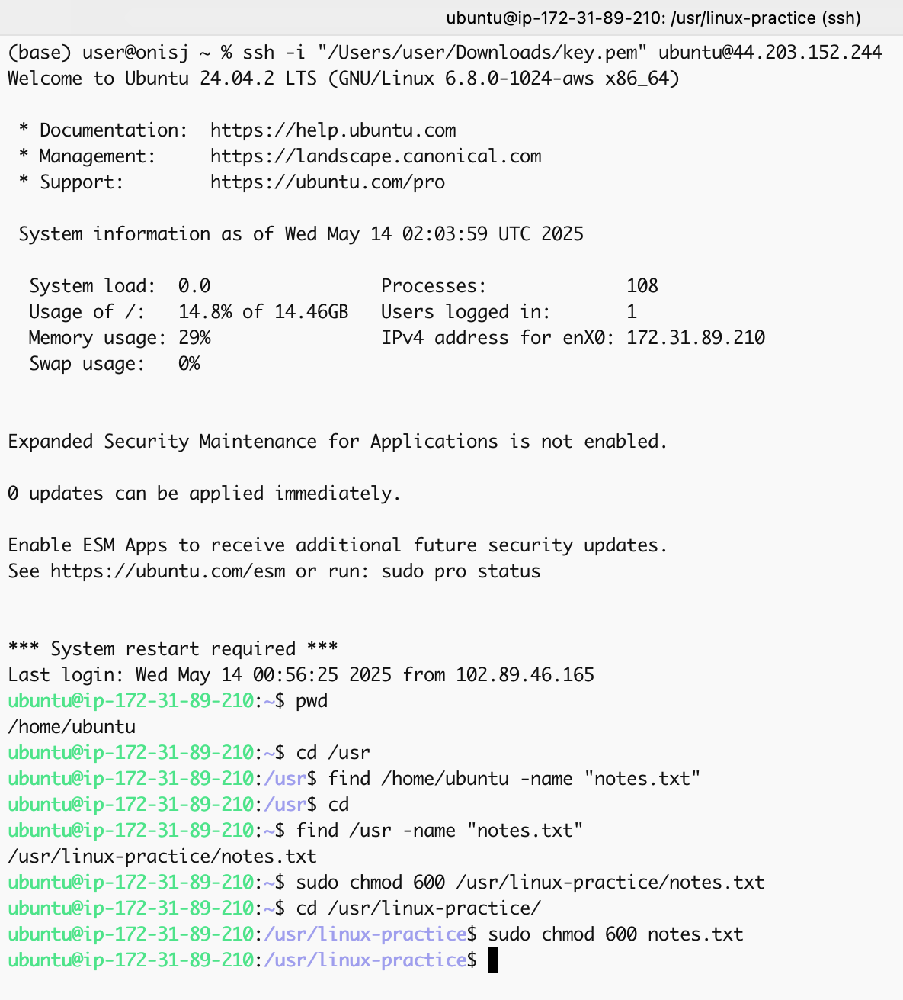
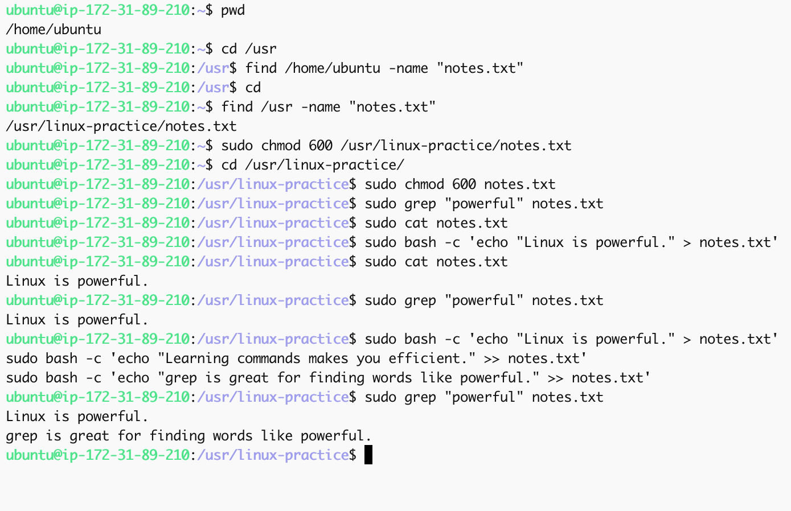
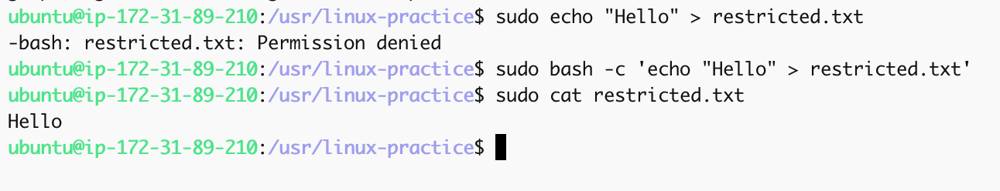
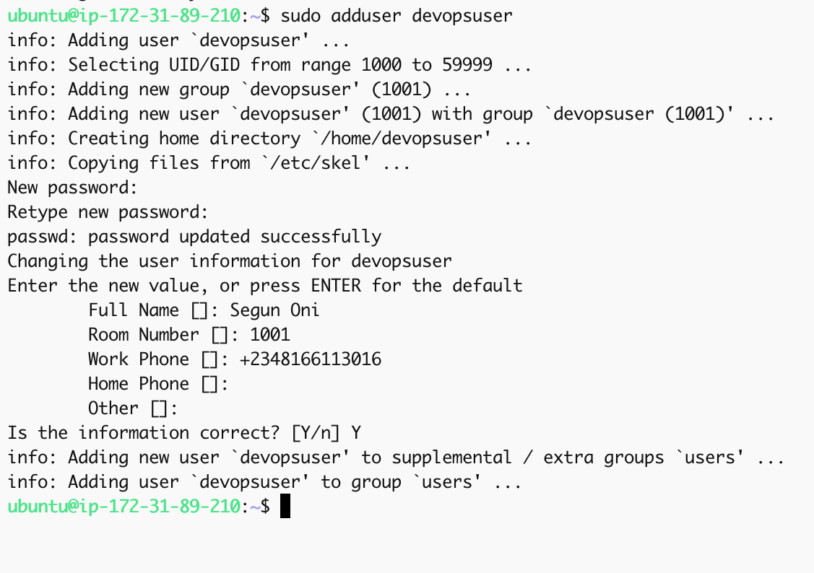
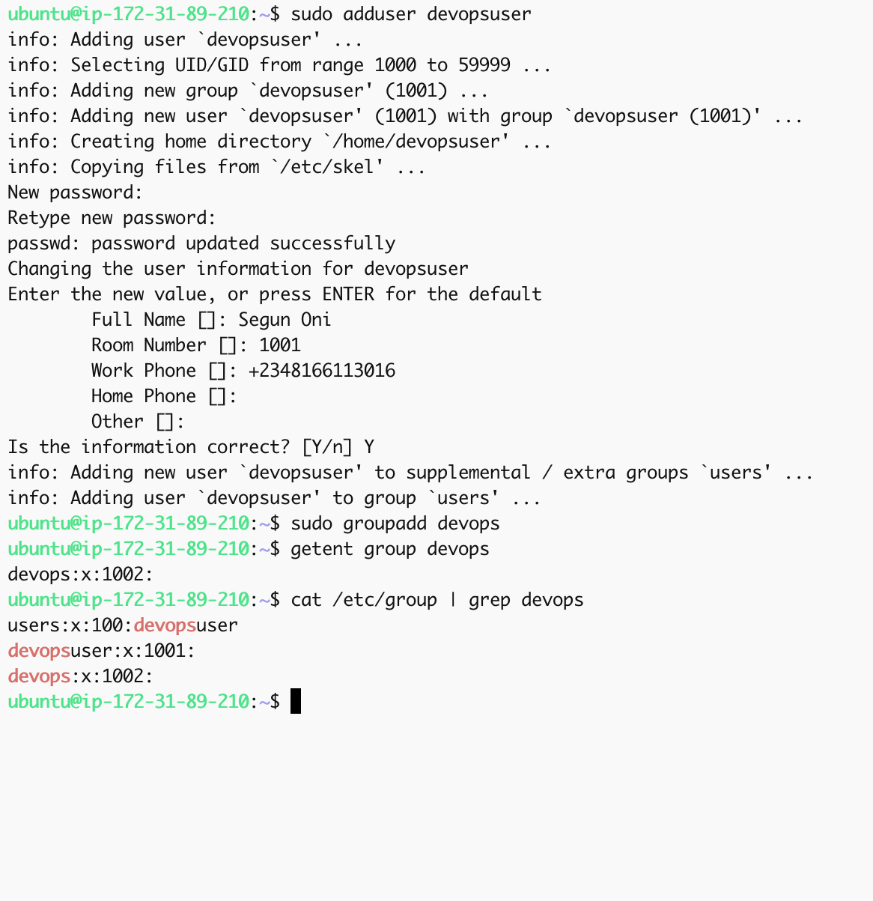
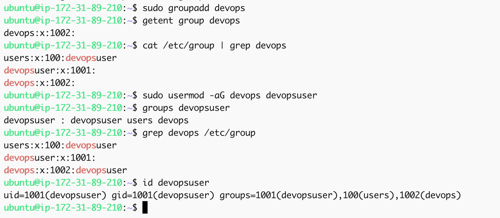
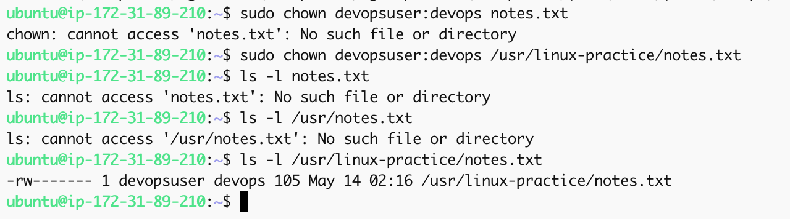
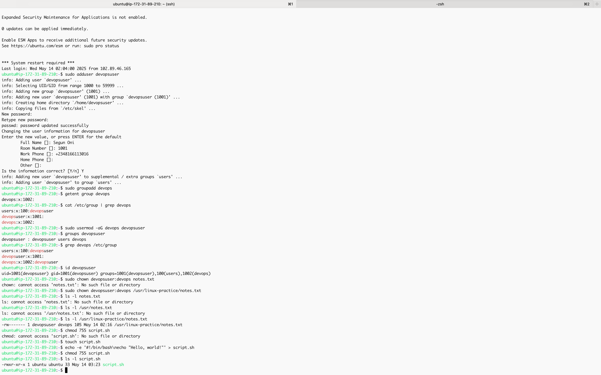
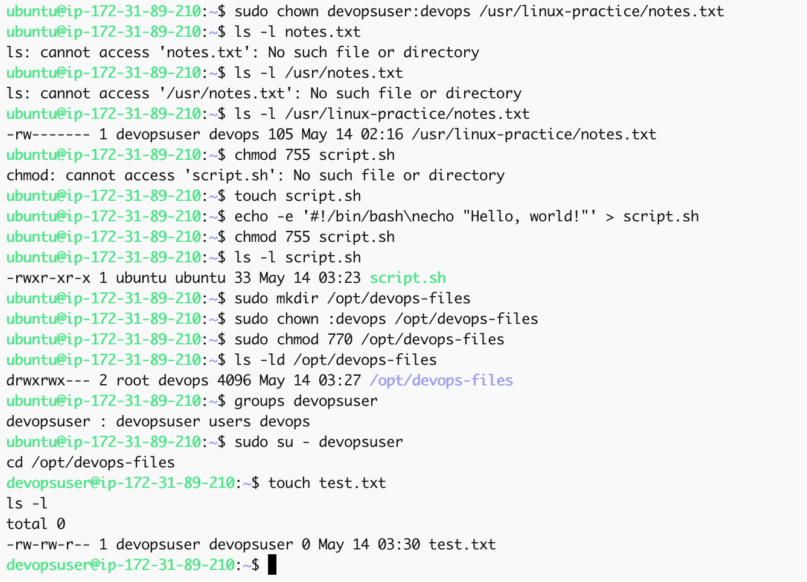

# Linux Commands & Filesystem Navigation – Hands-On DevOps Project

## Project Overview

This project provides a practical, hands-on introduction to essential Linux commands used in system administration and DevOps environments. The focus is on navigating the Linux filesystem, managing files and directories, using secure remote access (SSH), and applying real-world operations on a cloud-based Linux server (EC2 on AWS). Additional advanced commands including user and group management, file ownership, and permission structure are demonstrated to align with core administrative tasks.

---

## Objectives

- Demonstrate core Linux commands (`pwd`, `ls`, `mkdir`, `rm`, `find`, etc.)
- Manage users, groups, and file ownership with `adduser`, `groupadd`, `usermod`, and `chown`
- Modify file and directory permissions using `chmod` with both symbolic and numeric notation
- Use SSH to connect to a remote Ubuntu server
- Document command outputs and real-world relevance through screenshots

---

## Environment Setup

- **OS**: Ubuntu 20.04 LTS (AWS EC2)
- **Access**: SSH via macOS Terminal
- **Instance Type**: t2.micro (Free Tier)
- **Key File**: `ubuntu.pem`

---

## Connecting to EC2 via SSH

```bash
cd ~/Downloads
chmod 400 ubuntu.pem
ssh -i ubuntu.pem ubuntu@<your-public-ip>
````

Screenshot:


---

## Core Linux Commands & Tasks

### 1️. Print Current Directory

```bash
pwd
```

Screenshot:


---

### 2️. List Files and Hidden Files

```bash
ls -la
```

Screenshot:


---

### 3. Create and Rename Directories

```bash
mkdir devops-lab
mv devops-lab linux-practice
```

Screenshot:


---

### 4️. Create and Write to Files

```bash
cd linux-practice
touch notes.txt summary.log
sudo bash -c 'echo "Linux is powerful." > notes.txt'
cat notes.txt
```

Screenshot:


---

### 5️. Delete Files and Directories

```bash
rm summary.log
cd ..
rm -r linux-practice
```

Screenshot:


---

### 6️. Find Files

```bash
find /home/ubuntu -name "notes.txt"
```

Screenshot:


---

## Advanced Command Demonstration

### 7️. Modify File Permissions with `chmod`

```bash
sudo chmod 600 notes.txt
ls -l notes.txt
```

**Explanation**:
`600` = `rw-------` (owner can read/write; no access for others)

Screenshot:


---

### 8️. Search File Content with `grep`

```bash
grep "powerful" notes.txt
```

Screenshot:


---

### 9️. Error Handling Example

```bash
sudo echo "Hello" > restricted.txt
```

❌ Result: `Permission denied`
✅ Fix:

```bash
sudo bash -c 'echo "Hello" > restricted.txt'
```

Screenshot:


---

## 🧑‍💻 User and Group Management

### 10. Add a New User

```bash
sudo adduser devopsuser
```

Screenshot:


---

### 11. Create a New Group

```bash
sudo groupadd devops
```

Screenshot:


---

### 12. Add User to Group

```bash
sudo usermod -aG devops devopsuser
```

Screenshot:


---

### 13. Change File Ownership

```bash
sudo chown devopsuser:devops /usr/linux-practice/notes.txt
ls -l notes.txt
```

Screenshot:


---

### 14. Numeric Permissions with `chmod`

```bash
chmod 755 script.sh
```

**Explanation**:

* `7` = `rwx` for owner
* `5` = `r-x` for group
* `5` = `r-x` for others

Screenshot:


---

## ✅ Side Hustle Task: DevOps Group & Folder Permissions

```bash
sudo mkdir /opt/devops-files
sudo chown :devops /opt/devops-files
sudo chmod 770 /opt/devops-files
```

Screenshot:


---

## Real-World Use Case

This project simulates common responsibilities of Linux system admins and DevOps engineers:

* Secure server access via SSH
* Controlled file access with users, groups, and permissions
* Group-based permission assignments for secure collaboration
* Searching logs using `grep` and protecting configs with `chmod`
* Ownership transfers using `chown` in cloud environments

---

## Lessons Learned

* Managing Linux file systems, users, and groups is vital for DevOps
* Ownership and group access control help maintain secure environments
* `chmod`, `chown`, and `usermod` are core tools for system permission strategies
* Proper command structure (e.g., `sudo bash -c`) avoids execution errors
* Group-based folder access is key for multi-user DevOps projects

---

## Project Structure

```
linux-commands-project/
├── README.md
└── screenshots/
    ├── virtual_machine_connection.png
    ├── connection2.png
    ├── pwd.png
    ├── pwd_ls.png
    ├── mkdir_devops-lab-to-linux-practice.png
    ├── preview_with_cat.png
    ├── sudo_rms.png
    ├── find_name.png
    ├── chmod_notes.png
    ├── grep_notes.png
    ├── error_fix.png
    ├── adduser_devopsuser.png
    ├── groupadd_devops.png
    ├── usermod_addgroup.png
    ├── chown_notes.png
    ├── chmod_755_script.png
    └── devops_group_folder.png
```

---

## References & Resources

* [Linux Command Reference](https://linux.die.net/man/)
* [AWS EC2 Setup](https://docs.aws.amazon.com/ec2/)
* [Grep Tutorial](https://www.geeksforgeeks.org/grep-command-in-unixlinux/)
* [chmod Command Guide](https://linuxize.com/post/chmod-command/)
* [User and Group Management](https://www.geeksforgeeks.org/useradd-command-in-linux-with-examples/)

