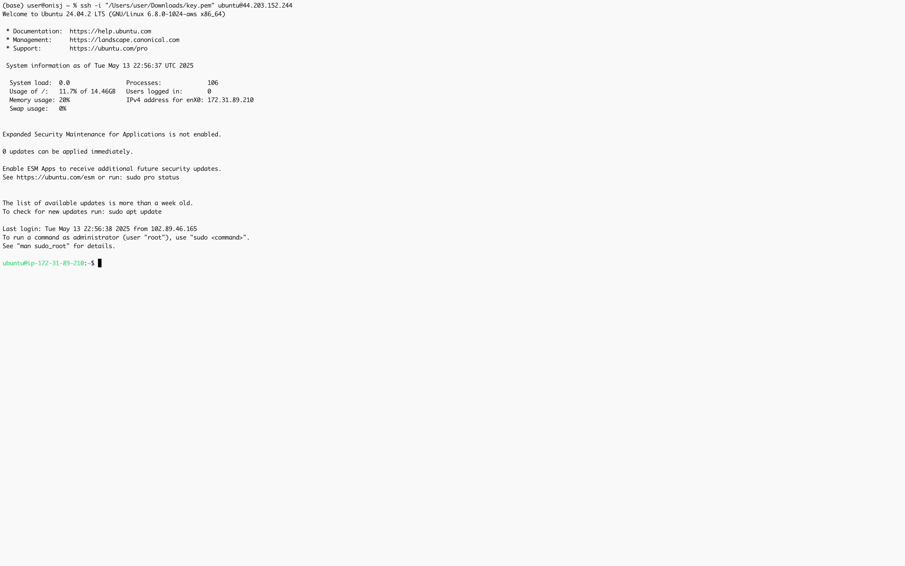
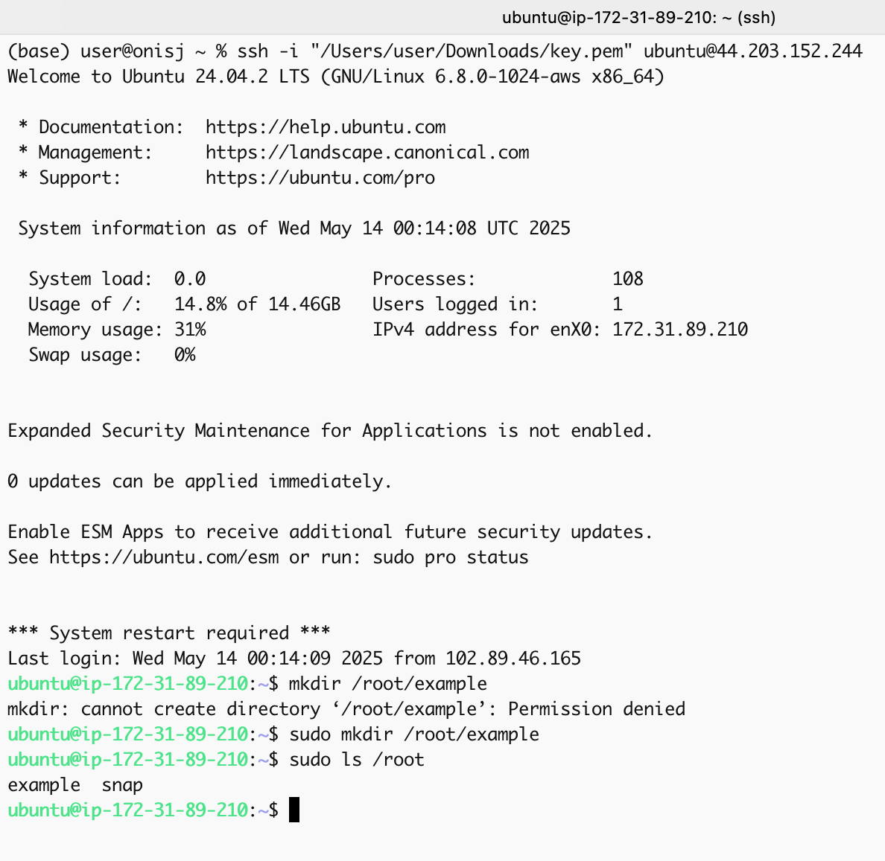
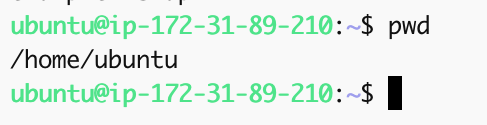
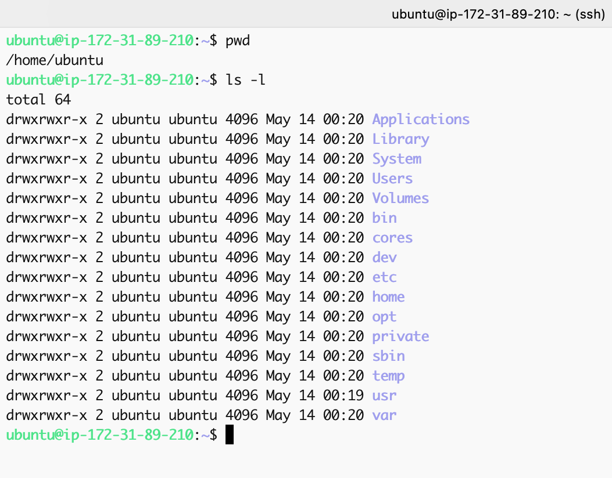
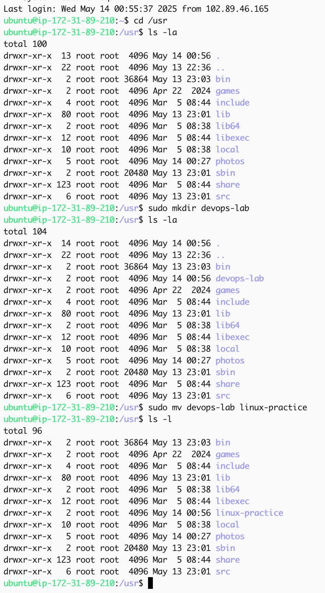
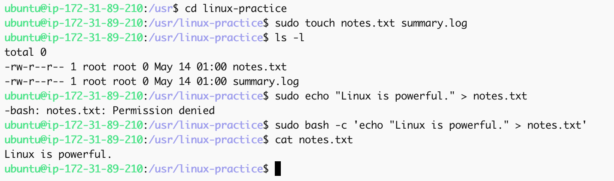
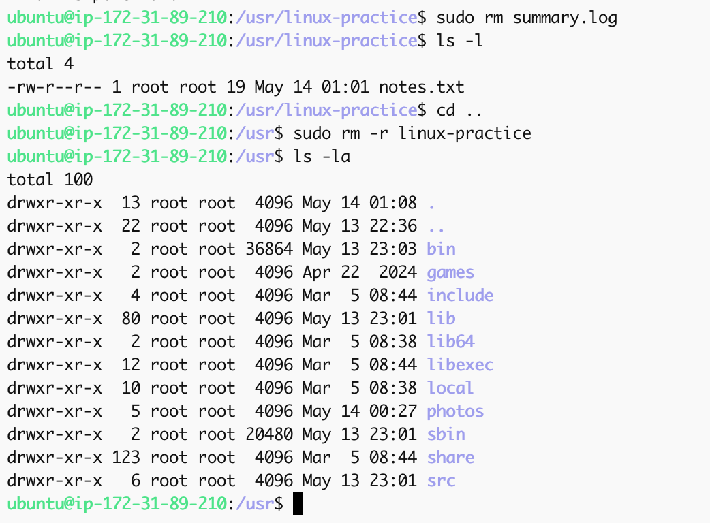

# Linux Commands & Filesystem Navigation – Hands-On DevOps Project

## Project Overview

This project is focused on building a foundational understanding of Linux by practicing core shell commands used in real-world DevOps and system administration environments. The goal is to simulate everyday tasks that system administrators and DevOps engineers routinely perform, such as navigating directories, managing files, and locating system resources using native Linux command-line utilities.

---

## Objectives

The instructor outlined the following learning objectives for this project:

- Demonstrate core Linux commands for navigation, file/directory creation, and manipulation
- Execute and document practical command-line tasks
- Apply Linux concepts to real-world use cases (e.g., working with cloud-based servers)
- Show understanding through output and screenshots of commands

---

## Environment Setup

- **Operating System**: Ubuntu 20.04 LTS (via EC2 on AWS)
- **Access Method**: SSH from macOS terminal
- **Instance Type**: t2.micro (Free Tier)

---

## SSH Access to Cloud Server

```bash
cd ~/Downloads
chmod 400 ubuntu.pem
ssh -i ubuntu.pem ubuntu@<your-public-ip>
````

Screenshot: Successful login to EC2 instance showing welcome message and hostname



---

## Filesystem Navigation & Management

### 1. Print Current Directory

```bash
pwd
```

Screenshot: Output of `pwd` showing `/home/ubuntu`



---

### 2. List Files and Directories

```bash
ls -la
```

Screenshot: Output showing hidden files and details


---

### 3. Create and Rename Directories

```bash
mkdir devops-lab
mv devops-lab linux-practice
```

Screenshot: Confirmed creation and renaming using `ls`


---

### 4. Create Files Inside Directories

```bash
cd linux-practice
touch notes.txt summary.log
echo "Linux is powerful." > notes.txt
```

Screenshot: Created files and content preview using `cat`

---

### 🗑️ 5. Delete Files and Folders

```bash
rm summary.log
cd ..
rm -r linux-practice
```

Screenshot: File and folder removal confirmation

---

### 🔍 6. Find Files and Directories

```bash
find /home/ubuntu -name "notes.txt"
```

Screenshot: Output showing correct file path


---

## Summary of Commands Demonstrated

| Command  | Purpose                          |
| -------- | -------------------------------- |
| `pwd`    | Print current directory          |
| `ls -la` | List all files, including hidden |
| `mkdir`  | Create directories               |
| `mv`     | Rename or move files/directories |
| `touch`  | Create empty files               |
| `echo`   | Write text to files              |
| `cat`    | View contents of files           |
| `rm`     | Delete files                     |
| `rm -r`  | Delete directories recursively   |
| `find`   | Search for files/directories     |

---

## Real-World Use Case

These command-line tasks simulate working as a DevOps engineer or system administrator managing:

* Server-side file operations
* Script storage and organization
* Cloud server configuration (e.g., EC2 via SSH)
* Automated job or CI/CD file handling

---

## Project Directory Structure

```
linux-commands-project/
├── README.md
└── screenshots/
    ├── login.png
    ├── pwd.png
    ├── mkdir.png
    ├── touch.png
    ├── find.png
    └── rm.png
```
---

## 🧠 Lessons Learned

* Navigating a Linux filesystem is foundational to DevOps and server administration
* SSH enables secure access to remote Linux servers
* Mastering simple commands like `ls`, `mkdir`, and `find` enhances productivity and automation skills
* Proper documentation of terminal activity helps track changes and is useful for audits and collaboration

---

## 🔗 Resources

* [Linux Command Reference](https://linux.die.net/man/)
* [AWS EC2 Guide](https://docs.aws.amazon.com/ec2/)
* [Beginner’s Guide to the Terminal](https://ubuntu.com/tutorials/command-line-for-beginners)

