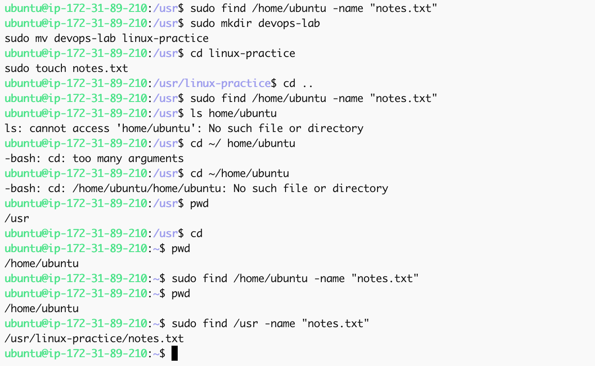

# Linux Commands & Filesystem Navigation – Hands-On DevOps Project

## Project Overview

This project provides a practical, hands-on introduction to essential Linux commands used in system administration and DevOps environments. The focus is on navigating the Linux filesystem, managing files and directories, using secure remote access (SSH), and applying real-world operations on a cloud-based Linux server (EC2 on AWS). Additional advanced commands are included to enhance understanding and reflect common professional practices.

---

## Objectives

- Demonstrate proficiency with core Linux commands (e.g., `pwd`, `ls`, `mkdir`, `rm`, `find`)
- Use secure shell (SSH) to connect to a remote Ubuntu server
- Perform file and directory creation, editing, deletion, and permission modification
- Apply advanced commands (`chmod`, `grep`) to simulate real-world DevOps use cases
- Document commands, outputs, and troubleshooting steps with screenshots

---

## Environment Setup

- **OS**: Ubuntu 20.04 LTS (AWS EC2)
- **Access**: SSH via macOS Terminal
- **Instance Type**: t2.micro (Free Tier)
- **Key File**: `ubuntu.pem`

---

## Connecting to EC2 via SSH

```bash
cd ~/Downloads
chmod 400 ubuntu.pem
ssh -i ubuntu.pem ubuntu@<your-public-ip>
````

Screenshot:


---

## Core Linux Commands & Tasks

### 1️. Print Current Directory

```bash
pwd
```

Screenshot:


---

### 2️. List Files and Hidden Files

```bash
ls -la
```

Screenshot:


---

### 3. Create and Rename Directories

```bash
mkdir devops-lab
mv devops-lab linux-practice
```

Screenshot:


---

### 4️. Create and Write to Files

```bash
cd linux-practice
touch notes.txt summary.log
sudo bash -c 'echo "Linux is powerful." > notes.txt'
cat notes.txt
```

Screenshot:


---

### 5️. Delete Files and Directories

```bash
rm summary.log
cd ..
rm -r linux-practice
```

Screenshot:


---

### 6️. Find Files

```bash
find /home/ubuntu -name "notes.txt"
```

Screenshot:




---

## Advanced Command Demonstration

### 7️. Modify File Permissions with `chmod`

```bash
sudo chmod 600 notes.txt
ls -l notes.txt
```

Screenshot:


---

### 8️. Search File Content with `grep`

```bash
grep "powerful" notes.txt
```

Screenshot:


---

### 9️. Error Handling Example

```bash
sudo echo "Hello" > restricted.txt
```

Result: `Permission denied`
Fix:

```bash
sudo bash -c 'echo "Hello" > restricted.txt'
```

Screenshot:


## Real-World Use Case

This project simulates real-world DevOps tasks:

* Accessing cloud-hosted Linux servers securely via SSH
* Managing log files and system directories
* Using `chmod` to secure configuration or secret files
* Searching logs using `grep` in CI/CD workflows
* Cleaning up or rotating files via batch commands

---

## Lessons Learned

* Navigating the Linux filesystem is foundational for DevOps
* SSH is a secure and essential tool for managing cloud servers
* Permission errors can be solved using `sudo` and proper redirection
* `grep` and `chmod` are indispensable in log parsing and system hardening
* Command chaining and redirection must be properly scoped with `bash -c`

---

## Project Structure

```
linux-commands-project/
├── README.md
└── screenshots/
    ├── virtual_machine_connection.png
    ├── connection2.png
    ├── pwd.png
    ├── pwd_ls.png
    ├── mkdir_devops-lab-to-linux-practice.png
    ├── preview_with_cat.png
    ├── sudo_rms.png
    ├── find_name.png
    ├── chmod_notes.png
    ├── grep_notes.png
    └── error_fix.png
```

---

## References & Resources

* [Linux Command Reference](https://linux.die.net/man/)
* [AWS EC2 Setup](https://docs.aws.amazon.com/ec2/)
* [Grep Tutorial](https://www.geeksforgeeks.org/grep-command-in-unixlinux/)
* [chmod Command Guide](https://linuxize.com/post/chmod-command/)
